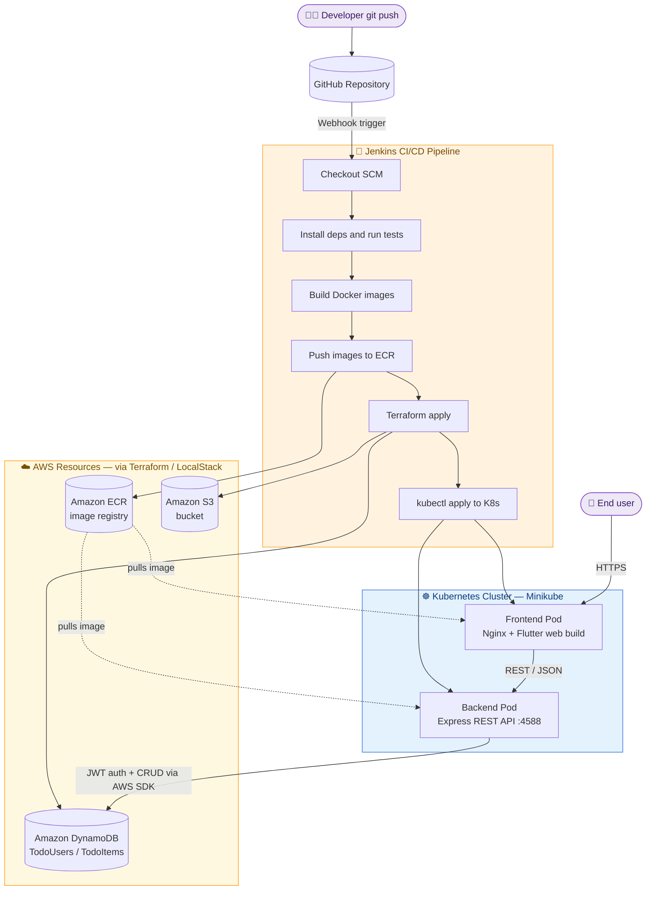

<div align="center">


<br/>

[](https://flutter.dev)
[](https://nodejs.org)
[](https://expressjs.com)
[](https://aws.amazon.com/dynamodb/)
[](https://aws.amazon.com)
[](https://www.docker.com)
[](https://kubernetes.io)
[](https://www.terraform.io)
[](https://www.jenkins.io)
[](https://jwt.io)


**A cloud-native, production-style To-Do application** — Flutter frontend, Express/Node.js REST API,
DynamoDB persistence, containerized with Docker, orchestrated with Kubernetes, provisioned with
Terraform, and shipped through an automated Jenkins CI/CD pipeline.

</div>

<br/>

<p align="center">
  
</p>

## 📖 Table of Contents

- [Overview](#-overview)
- [Features](#-features)
- [Tech Stack](#️-tech-stack)
- [System Architecture](#-system-architecture)
- [CI/CD Pipeline (Jenkins)](#-cicd-pipeline-jenkins)
- [Project Structure](#-project-structure)
- [Getting Started](#-getting-started)
- [Environment Variables](#-environment-variables)
- [API Reference](#-api-reference)
- [Database Schema](#-database-schema)
- [Roadmap](#-roadmap)
- [Contributing](#-contributing)
- [License](#-license)
- [Author](#-author)

<br/>

## ✨ Overview

This project is a **complete task-management platform** built to demonstrate a real end-to-end
software delivery lifecycle — not just an app, but the infrastructure and automation around it.

Users can register, log in, and manage personal to-do items through a Flutter client (Web, Android,
iOS, Desktop) backed by a stateless Express REST API. Authentication is handled with JWT, passwords
are hashed with bcrypt, and all data is persisted in Amazon DynamoDB. The entire stack is
containerized, deployed to Kubernetes, provisioned with Terraform, and automated end-to-end with
a Jenkins pipeline.

<br/>

## 🚀 Features

| | |
|---|---|
| 🔐 **Secure Authentication** | JWT-based sessions with bcrypt password hashing |
| ✅ **Full CRUD** | Create, list, and delete personal to-do items |
| 📱 **Cross-Platform Client** | One Flutter codebase → Web, Android, iOS, Windows, macOS, Linux |
| 🗄️ **NoSQL Persistence** | Amazon DynamoDB with on-demand billing |
| 🐳 **Containerized** | Independent Docker images for frontend & backend |
| ☸️ **Orchestrated** | Kubernetes Deployments + Services for both tiers |
| 🌍 **Infrastructure as Code** | Terraform-managed AWS resources (DynamoDB, S3, ECR) |
| 🔁 **Automated CI/CD** | Jenkins pipeline: build → test → containerize → provision → deploy |

<br/>

## 🛠️ Tech Stack

<table>
<tr>
<td valign="top" width="50%">

**Frontend**

| Tool | Purpose |
|---|---|
|  | Cross-platform UI framework |
|  | Application language |
|  | Serves the compiled web build |

**Backend**

| Tool | Purpose |
|---|---|
|  | JavaScript runtime |
|  | REST API framework |
|  | Stateless authentication |
|  | Password hashing |

</td>
<td valign="top" width="50%">

**Database & Cloud**

| Tool | Purpose |
|---|---|
|  | Primary NoSQL data store |
|  | Object storage / Terraform assets |
|  | Container image registry |
|  | Local AWS emulation for dev |

**DevOps & Infrastructure**

| Tool | Purpose |
|---|---|
|  | Containerization |
|  | Container orchestration |
|  | Infrastructure as Code |
|  | CI/CD automation |

</td>
</tr>
</table>

<br/>

## 🏗️ System Architecture

> One diagram, end to end — from a developer's `git push` all the way to a served request in
> production.



<br/>

## 🔁 CI/CD Pipeline (Jenkins)

The Jenkins pipeline is what turns a `git push` into a running Pod. Each stage maps to a
`Jenkinsfile` stage block:

| Stage | What happens | Key tools |
|---|---|---|
| 1️⃣ **Checkout** | Jenkins pulls the latest commit from GitHub via webhook trigger | `Jenkins`, `Git` |
| 2️⃣ **Install & Test** | Backend deps installed (`npm ci`), Flutter deps fetched (`flutter pub get`), lint/tests run | `npm`, `Flutter CLI` |
| 3️⃣ **Build images** | Backend and frontend Docker images built from their respective `Dockerfile`s | `Docker` |
| 4️⃣ **Push to registry** | Tagged images pushed to Amazon ECR | `Docker`, `AWS ECR` |
| 5️⃣ **Provision infra** | `terraform apply` ensures DynamoDB tables, S3 bucket, and ECR repo are up to date | `Terraform` |
| 6️⃣ **Deploy** | `kubectl apply -f infrastructure/k8s/` rolls out the new images to the cluster | `kubectl`, `Kubernetes` |
| 7️⃣ **Verify** | Rollout status + health checks confirm the new Pods are ready | `kubectl rollout status` |

<details>
<summary>📄 Example <code>Jenkinsfile</code> (declarative pipeline)</summary>

```groovy
pipeline {
    agent any

    environment {
        ECR_REGISTRY = "<account-id>.dkr.ecr.us-east-1.amazonaws.com"
        IMAGE_TAG    = "${env.BUILD_NUMBER}"
    }

    stages {
        stage('Checkout') {
            steps { checkout scm }
        }

        stage('Install & Test - Backend') {
            steps {
                dir('backend') {
                    sh 'npm ci'
                    sh 'npm test || true'
                }
            }
        }

        stage('Install & Test - Frontend') {
            steps {
                dir('to_do_app') {
                    sh 'flutter pub get'
                    sh 'flutter test || true'
                }
            }
        }

        stage('Build Docker Images') {
            steps {
                sh "docker build -t $ECR_REGISTRY/todo-app:$IMAGE_TAG ./backend"
                sh "docker build -t $ECR_REGISTRY/todo-frontend:$IMAGE_TAG ./to_do_app"
            }
        }

        stage('Push to ECR') {
            steps {
                sh "aws ecr get-login-password | docker login --username AWS --password-stdin $ECR_REGISTRY"
                sh "docker push $ECR_REGISTRY/todo-app:$IMAGE_TAG"
                sh "docker push $ECR_REGISTRY/todo-frontend:$IMAGE_TAG"
            }
        }

        stage('Terraform Apply') {
            steps {
                dir('infrastructure/terraform') {
                    sh 'terraform init -input=false'
                    sh 'terraform apply -auto-approve'
                }
            }
        }

        stage('Deploy to Kubernetes') {
            steps {
                sh 'kubectl apply -f infrastructure/k8s/'
                sh 'kubectl rollout status deployment/todo-backend'
                sh 'kubectl rollout status deployment/todo-frontend'
            }
        }
    }

    post {
        success { echo '✅ Pipeline completed — new version deployed.' }
        failure { echo '❌ Pipeline failed — check stage logs.' }
    }
}
```

</details>

<br/>

## 📂 Project Structure

```text
To-Do-app/
├── backend/                     # Express REST API
│   ├── config/
│   │   └── dynamodb.js          # DynamoDB client configuration
│   ├── controller/
│   │   ├── user.controller.js   # Register / login handlers
│   │   └── todo.controller.js   # CRUD handlers
│   ├── routers/
│   │   ├── user.route.js
│   │   └── todo.route.js
│   ├── services/
│   │   ├── user.services.js     # bcrypt + JWT logic
│   │   └── todo.services.js     # DynamoDB operations
│   ├── app.js                   # Express app + middleware
│   ├── index.js                 # Server entrypoint (port 4588)
│   ├── Dockerfile
│   └── package.json
│
├── to_do_app/                   # Flutter client
│   ├── lib/
│   │   ├── screens/              # login, signup, home, todo screens
│   │   ├── config.dart           # API base URL + endpoints
│   │   └── main.dart
│   ├── Dockerfile                # Multi-stage build -> Nginx
│   └── pubspec.yaml
│
├── infrastructure/
│   ├── terraform/                # IaC: DynamoDB, S3, ECR
│   │   ├── dynamodb.tf
│   │   ├── ecr.tf
│   │   ├── s3.tf
│   │   ├── provider.tf
│   │   └── variables.tf
│   └── k8s/                      # Kubernetes manifests
│       ├── backend-deployment.yaml
│       ├── backend-config.yaml
│       ├── backend-secret.yaml
│       ├── todo-backend-service.yaml
│       ├── frontend-deployment.yaml
│       └── todo-frontend-service.yaml
│
├── Jenkinsfile                   # CI/CD pipeline definition
└── README.md
```

<br/>

## ⚙️ Getting Started

### Prerequisites


### 1. Clone the repository

```bash
git clone https://github.com/saurabhisane/To-Do-app.git
cd To-Do-app
```

### 2. Run the backend locally

```bash
cd backend
npm install
npm run dev          # nodemon, watches for changes
# Server runs on http://localhost:4588
```

### 3. Run the Flutter client

```bash
cd to_do_app
flutter pub get
flutter run -d chrome --dart-define=API_BASE_URL=http://localhost:4588/
```

### 4. Spin up infrastructure locally (LocalStack + Terraform)

```bash
cd infrastructure/terraform
terraform init
terraform apply -auto-approve
```

### 5. Build & deploy with Docker + Kubernetes

```bash
# Build images
docker build -t todo-app:latest ./backend
docker build -t todo-frontend:latest ./to_do_app

# Deploy to your cluster
kubectl apply -f infrastructure/k8s/
```

### 6. Automate it all with Jenkins

Point a Jenkins multibranch pipeline job at this repository — the included `Jenkinsfile`
handles build, test, image push, Terraform provisioning, and Kubernetes rollout automatically
on every push.

<br/>

## 🔐 Environment Variables

| Variable | Description | Default |
|---|---|---|
| `AWS_REGION` | AWS region for DynamoDB client | `us-east-1` |
| `DYNAMODB_ENDPOINT` | DynamoDB endpoint (LocalStack or real AWS) | `http://localhost:4566` |
| `AWS_ACCESS_KEY_ID` | AWS access key | `test` |
| `AWS_SECRET_ACCESS_KEY` | AWS secret key | `test` |
| `JWT_SECRET` | Secret used to sign JWTs | `SecretKey` |
| `API_BASE_URL` | Base API URL consumed by the Flutter client | `http://192.168.49.2:32300/` |

> ⚠️ Replace the default dev credentials and JWT secret with real secrets (e.g. via Kubernetes
> `Secret` objects or a secrets manager) before deploying beyond local development.

<br/>

## 📡 API Reference

| Method | Endpoint | Description | Auth |
|---|---|---|---|
| `POST` | `/registration` | Register a new user | ❌ |
| `POST` | `/login` | Authenticate and receive a JWT | ❌ |
| `POST` | `/todo` | Create a new to-do item | ✅ |
| `POST` | `/getTodoData` | Fetch all to-dos for a user | ✅ |
| `POST` | `/deleteTodo` | Delete a to-do item | ✅ |

<br/>

## 🗄️ Database Schema

| Table | Partition Key | Sort Key | Notes |
|---|---|---|---|
| `TodoUsers` | `email` (String) | — | Stores hashed password + generated `userId` |
| `TodoItems` | `userId` (String) | `todoId` (String) | One item per to-do, scoped per user |

<br/>

## 🗺️ Roadmap

- [ ] Add automated test coverage (backend + Flutter widget tests)
- [ ] Add Ingress + TLS for the Kubernetes cluster
- [ ] Multi-replica Deployments with HPA
- [ ] Centralized logging & monitoring (CloudWatch / Prometheus + Grafana)
- [ ] Move Jenkins secrets to a dedicated secrets manager

<br/>

## 🤝 Contributing

Contributions are welcome! To contribute:

1. Fork the repository
2. Create a feature branch (`git checkout -b feature/amazing-feature`)
3. Commit your changes (`git commit -m 'Add amazing feature'`)
4. Push to the branch (`git push origin feature/amazing-feature`)
5. Open a Pull Request

<br/>

## 📄 License

This project is licensed under the **MIT License** — see the [LICENSE](LICENSE) file for details.

<br/>

## 👤 Author

**Saurabh Isane**

[](https://github.com/saurabhisane)

<br/>

<p align="center">
  
</p>

<div align="center">

⭐ **If this project helped you, consider giving it a star!** ⭐

</div>
